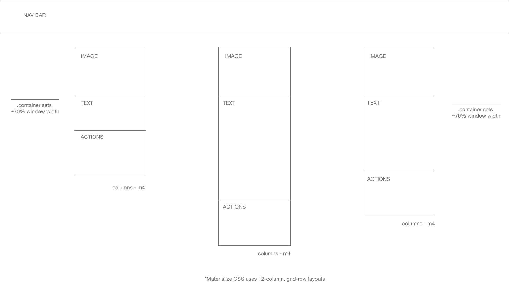

# Unit 2 Project - CRUD Application

## Technologies Used
Distributed via [Heroku](https://www.heroku.com), a platform as a service. 

[Node.js](https://nodejs.org/en/) - an open source Javascript runtime environment, allowing JS code outside of a web browser

[MongoDB](https://www.mongodb.com) - a cross platform, document-oriented, NoSQL database program

[Mongoose](https://www.mongoosejs.com) - an Object Data Modeling (ODM) library for MongoDB and Node.js.

[HTML](https://developer.mozilla.org/en-US/docs/Web/HTML) / [CSS](https://developer.mozilla.org/en-US/docs/Web/CSS) - page styling with Google's [Materialize](https://materializecss.com) CSS framework.

[Express.js](https://expressjs.com) - a module server framework for Node

[JSX](https://facebook.github.io/jsx/) - JavaScript Extension, used by React to create reusable web components

## User Stories
1. As a user, I want to be able to add a new series to track shows I may be interested in.
2. As a user, I want to be able to add new episodes I may be interested in.
3. As a user, I want to be able to link episodes to series, so I can see all episodes related to a series
4. As a user, I want to be able to add information such as: 
   * Title of episode or series
   * Synopsis of episode or series
   * Number of episodes
   * Season episode or series was aired
   * Person rating of episode or series (from 1 - 5)
   * Any notes
   * Link to episode or series image
5. I want to be able to visit a page that shows all my series I'm tracking
6. When clicking on a series, I want to see information about that series and information about related episodes

## Approach Taken
As anime tends to be a very visual form of media, I wanted to utilize Materialize's cards as a way to visually lay out and display series.

Each series has options to either get more information about the series, edit the series, add episodes, or delete the series from the page. 

On each page for a particular series is more detailed information such as number of episodes, rating, etc., but also additional cards of related episodes. 

## Card Wireframes

## Future Features
* Being able to sort the lists with attributes (i.e. by title, alphabetically, etc.)
* Being able to physically click/drag to move and resize cards
* Being able to physically stack and group cards
* Selective sort, such as for title, keyword, etc.
* Select the number of cards to see on the screen at any given time
* API to other databases that may have live data, such as streaming services or news sites
* Login system for multiple users, user accounts
* Share via Facebook, Twitter, etc.

## Unsolved Problems
* Card layouts can get be a little unpredictable when adding new cards

## Notes
* Utilizing Heroku + [mLab](https://mlab.com) MonboDB to deploy app
* [Heroku app](https://mae-unit2project.herokuapp.com/anime) Anime Tracker
* [Github repository](https://github.com/timrager/unit2project)